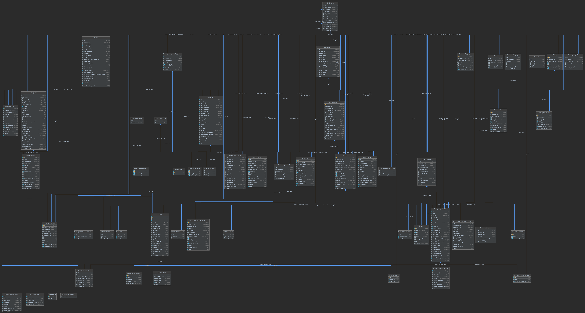

# Superset Dashbaord

Sample dashboard that can be used for performance monitoring.

## Local Startup

```
make startup
```

### Connecting to the Databases

Connect to the postgres database if your want to inspect the db state.

host: localhost  
port: 5432  
username: superset  
password: superset  
database: superset  

The following is a general overview of the superset schema.



### References

- https://github.com/apache/superset
- https://superset.apache.org/docs/installation/installing-superset-using-docker-compose